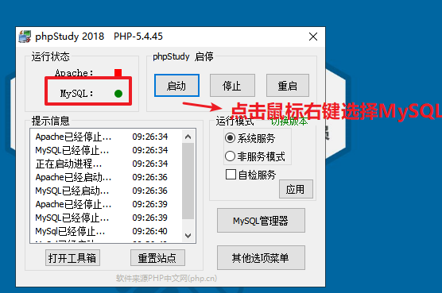
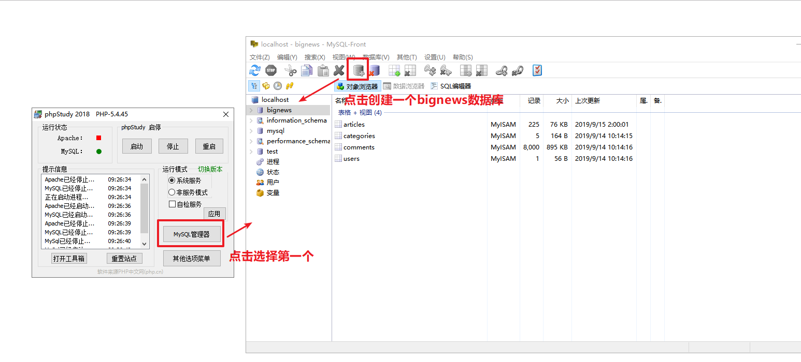
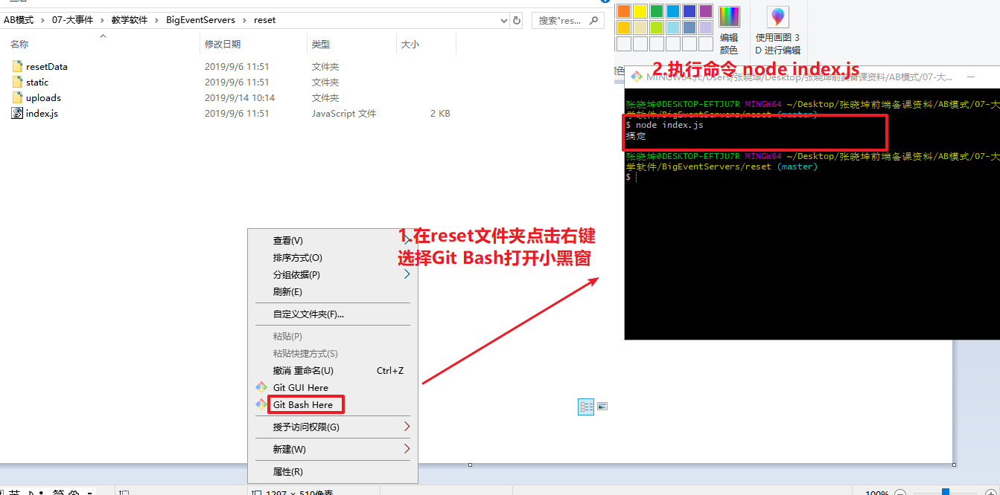
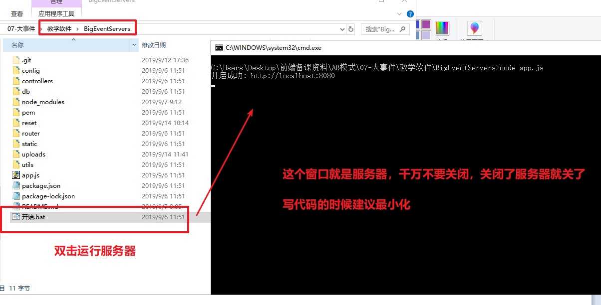
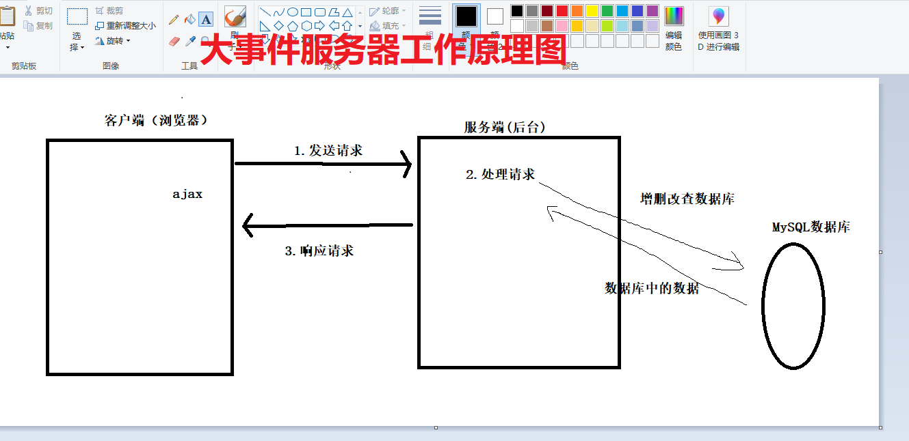

## 运行说明 - 数据库
1. 项目的数据保存在mysql中,先保证打开mysql

   

2. 在数据库中新建一个库`bignews`

   

3. 打开config/index.js中的 下面几个地方,调整成和自己数据库设置相同的设置

   *** 该配值为默认配值，如果不想要自定义数据库名称可以省略***
```
    // 库名
    database:'bignews',
    // 用户名
    username:'root',
    // 密码
    password:'root',
    // 主机
    host:'127.0.0.1',
    // 项目运行端口
    port:8080,
    // 项目基地址
    baseUrl:'http://localhost'
```

## 运行说明 - 初始数据
1. 模拟的数据在reset文件夹中（进入到reset文件夹，点击右键选择Git Bash Hear打开小黑窗）
2. 用node运行 index.js即可导入测试数据`node index.js`
3. 等待操作结束



## 运行说明 - 运行项目
1. 保证上述2步运行完毕之后,双击`开启.bat`即可
2. 也可以输入命令`node app.js`




* 以上只需要第一次配值即可，以后每天我们只需要做两件事
  * 1.开启phpstudy运行mysql数据库
  * 2.双击`开始.bat`打开服务器




## 项目基地址

项目的基地址是就是配置的地址比如配置的是

```
port:8080
baseUrl:'http://localhost'
```

那么项目的基地址就是:http://localhost:8080/api/v1

基地址+端口+/api/vi

## 接口说明

- 接口认证统一使用 Token 认证
- 需要授权的 API ，必须在请求头中使用 `Authorization` 字段提供 `token` 令牌
- 使用 HTTP Status Code 标识状态
- 数据返回格式统一使用 JSON


## 状态说明

| _状态码_ | _含义_              | _说明_                                              |
| -------- | ------------------- | --------------------------------------------------- |
| 200      | OK                  | 请求成功                                            |
| 201      | CREATED             | 创建成功                                            |
| 204      | DELETED             | 删除成功                                            |
| 400      | BAD REQUEST         | 请求的地址不存在或者包含不支持的参数                |
| 401      | UNAUTHORIZED        | 未授权                                              |
| 403      | FORBIDDEN           | 被禁止访问                                          |
| 404      | NOT FOUND           | 请求的资源不存在                                    |
| 422      | Unprocesable entity | [POST/PUT/PATCH] 当创建一个对象时，发生一个验证错误 |
| 500      | INTERNAL SERVER ERROR | 内部错误   

## 后台接口

#### 1、用户登录

请求地址：/admin/user/login

请求方式：post

请求参数：

| 名称     | 类型   | 说明            |
| -------- | ------ | --------------- |
| username | string | 用户名（admin） |
| password | string | 密码(123456)    |

返回数据：

| 名称  |  类型  | 说明                                             |
| :---: | :----: | ------------------------------------------------ |
|  msg  | string | 文字信息  ‘登录成功’   ‘用户名或密码出错’        |
| token | string | 登录成功获取的token，后续的所有接口都依赖于token |


#### 2、获取用户信息

请求地址：/admin/user/info

请求方式：get

请求参数：无

返回数据：

|   名称   |  类型  | 说明         |
| :------: | :----: | ------------ |
| nickname | string | 用户昵称     |
| userPic  | string | 用户图片地址 |


#### 3、获取用户详情

请求地址：/admin/user/detail

请求方式：get

请求参数：无

返回数据：

|   名称   |  类型  | 说明         |
| :------: | :----: | ------------ |
| username | string | 用户名称     |
| nickname | string | 用户昵称     |
|  email   | string | 用户邮箱     |
| userPic  | string | 用户图片地址 |
| password | string | 用户密码     |


#### 4、编辑用户信息

请求地址：/admin/user/edit

请求方式：post

请求数据：使用formData提交

|   名称   |  类型  | 说明         |
| :------: | :----: | ------------ |
| username | string | 用户名称     |
| nickname | string | 用户昵称     |
|  email   | string | 用户邮箱     |
| userPic  |  file  | 用户图片地址 |
| password | string | 用户密码     |

返回数据：

| 名称 |  类型  | 说明                              |
| :--: | :----: | --------------------------------- |
| msg  | string | 文字信息  ‘修改成功’   ‘修改失败’ |


#### 5、所有文章类别

请求地址：/admin/category/list

请求方式：get

请求参数：无

返回数据：文章

| 名称 |  类型  | 说明     |
| :--: | :----: | -------- |
|  id  | number | 类别     |
| name | string | 类别名称 |
| slug | string | 别名     |


#### 6、新增文章类别

请求地址：/admin/category/add

请求方式：post

请求参数：

| 名称 | 类型   | 说明     |
| ---- | ------ | -------- |
| name | string | 类别名称 |
| slug | string | 别名     |

返回数据：

| 名称 |  类型  | 说明                              |
| :--: | :----: | --------------------------------- |
| msg  | string | 文字信息  ‘增加成功’   ‘增加失败’ |

#### 7、根据id查询指定文章类别

请求地址：/admin/category/search

请求方式：get

请求参数：id

| 名称 | 类型   | 说明       |
| ---- | ------ | ---------- |
| id   | number | 文章类别id |

返回数据：

| 名称 |  类型  | 说明     |
| :--: | :----: | -------- |
|  id  | number | 类别     |
| name | string | 类别名称 |
| slug | string | 别名     |

#### 8、编辑文章类别

请求地址：/admin/category/edit

请求方式：post

请求参数：

| 名称 | 类型   | 说明     |
| ---- | ------ | -------- |
| id   | number | 类别id   |
| name | string | 类别名称 |
| slug | string | 别名     |

返回数据：

| 名称 |  类型  | 说明                              |
| :--: | :----: | --------------------------------- |
| msg  | string | 文字信息  ‘编辑成功’   ‘编辑失败’ |


#### 9、删除文章类别

请求地址：/admin/category/delete

请求方式：post

请求参数：

| 名称 | 类型   | 说明   |
| ---- | ------ | ------ |
| id   | number | 文章id |

返回数据：

| 名称 |  类型  | 说明                              |
| :--: | :----: | --------------------------------- |
| msg  | string | 文字信息  ‘删除成功’   ‘删除失败’ |

#### 10、文章搜索

请求地址：/admin/article/query

请求方式：get

请求参数：

|  名称   |  类型  | 说明                                         |
| :-----: | :----: | -------------------------------------------- |
|   key   | string | 搜索关键词，可以为空，为空返回某类型所有文章 |
|  type   | string | 文章类型id，可以为空，为空返回所有类型文章   |
|  state  | string | 文章状态，草稿 ，已发布,为空返回所有状态文章 |
|  page   | number | 当前页，为空返回第1页                        |
| perpage | number | 每页显示条数，为空默认每页6条                |

返回数据：

| 名称  |  类型  | 说明                                                         |
| :---: | :----: | ------------------------------------------------------------ |
| pages | number | 总页数                                                       |
| page  | number | 当前页                                                       |
| data  | array  | 文章数据数组，其中每个成员包含字段：<br />id: number类型，文章id<br />title:  string类型，文章标题<br />intro: string类型，文章文字内容截取<br />cover: string类型，文章封面图片地址<br />type: string类型，文章类型<br />read: number类型，文章阅读次数<br />comment: number类型，文章评论次数<br />date:string类型， 文章发布时间<br />state:string类型，文章状态 |


#### 11、发布文章

请求地址：/admin/article/publish

请求方式：post

请求参数：通过`formData`提交

| 名称       | 类型   | 说明                            |
| ---------- | ------ | ------------------------------- |
| title      | string | 文章标题                        |
| cover      | file   | 文章封面图片                    |
| categoryId | number | 文章类型id                      |
| date       | string | 日期                            |
| content    | string | 文章内容                        |
| state      | string | 已发布，草稿 （为空默认为草稿） |

返回数据：

| 名称 |  类型  | 说明                              |
| :--: | :----: | --------------------------------- |
| msg  | string | 文字信息  ‘发布成功’   ‘发布失败’ |


#### 12、根据id获取文章信息

请求地址：/admin/article/search

请求方式：get

请求参数：

| 名称 | 类型   | 说明   |
| ---- | ------ | ------ |
| id   | number | 文章id |

返回数据：


| 名称       | 类型   | 说明         |
| ---------- | ------ | ------------ |
| id         | number | 文章id       |
| title      | string | 文章标题     |
| cover      | file   | 文章封面图片 |
| categoryId | number | 文章类型id   |
| date       | string | 日期         |
| content    | string | 文章内容     |


#### 13、文章编辑

请求地址：/admin/article/edit

请求方式：post

请求参数：

| 名称       | 类型   | 说明                            |
| ---------- | ------ | ------------------------------- |
| id         | number | 文章id                          |
| title      | string | 文章标题                        |
| cover      | file   | 文章封面图片(可以为空)          |
| categoryId | number | 文章类型id                      |
| date       | string | 日期                            |
| content    | string | 文章内容                        |
| state      | string | 已发布，草稿 （为空默认为草稿） |

返回数据：

| 名称 |  类型  | 说明                              |
| :--: | :----: | --------------------------------- |
| msg  | string | 文字信息  ‘修改成功’   ‘修改失败’ |


#### 14、删除文章

请求地址：/admin/article/delete

请求方式：post

请求参数：

| 名称 | 类型   | 说明   |
| ---- | ------ | ------ |
| id   | number | 文章id |

返回数据：

| 名称 |  类型  | 说明                              |
| :--: | :----: | --------------------------------- |
| msg  | string | 文字信息  ‘删除成功’   ‘删除失败’ |


#### 15、获取统计数据

请求地址：/admin/data/info

请求方式：get

请求参数：无

返回数据：

|     名称     |  类型  | 说明         |
| :----------: | :----: | ------------ |
| totalArticle | number | 文章总数     |
|  dayArticle  | number | 日新增文章数 |
| totalComment | number | 总评论数     |
|  dayComment  | number | 日新增评论数 |


#### 16、日新增文章数量统计

请求地址：/admin/data/article

请求方式：get

请求参数：

返回数据：

```js
{
    "code": 200,
    "msg": "获取成功",
    "date": [
        {
            "date": "2019-05-20",
            "count": 23
        },
        {
            "date": "2019-05-21",
            "count": 19
        },
        {
            "date": "2019-05-22",
            "count": 29
        },
        {
            "date": "2019-05-23",
            "count": 24
        },
        {
            "date": "2019-05-24",
            "count": 28
        },
        {
            "date": "2019-05-25",
            "count": 28
        },
        {
            "date": "2019-05-26",
            "count": 19
        },
        {
            "date": "2019-05-27",
            "count": 25
        },
        {
            "date": "2019-05-28",
            "count": 25
        },
        {
            "date": "2019-7-30",
            "count": 3
        }
    ]
}
```

#### 17、各类型文章数量统计

请求地址：/admin/data/category

请求方式：get

请求参数：

返回数据：（有多少类型，就返回多少条）

```js
{
    "code": 200,
    "msg": "获取成功",
    "date": [
        {
            "name": "爱旅行",
            "articles": 41
        },
        {
            "name": "爱生活",
            "articles": 72
        },
        {
            "name": "爱美食",
            "articles": 36
        },
        {
            "name": "爱运动",
            "articles": 47
        },
        {
            "name": "经济特区",
            "articles": 33
        }
    ]
}
```


#### 18、日文章访问量

请求地址：/admin/data/visit

请求方式：get

请求参数：

返回数据：（返回最近1周的，也就是7条）

返回数据结构示例：

```json
{
    "code": 200,
    "msg": "日访问量统计数据获取成功",
    "data": {
        "2019-05-28": 13016,
        "2019-05-27": 11503,
        "2019-05-26": 9128,
        "2019-05-25": 13155,
        "2019-05-24": 12734,
        "2019-05-23": 10714,
        "2019-05-22": 16282
    }
}
```


#### 19、文章评论搜索

请求地址：/admin/comment/search

请求方式：get

请求参数：

|  名称   |  类型  | 说明                          |
| :-----: | :----: | ----------------------------- |
|  page   | number | 当前页，为空返回第1页         |
| perpage | number | 每页显示条数，为空默认每页6条 |

返回数据：

|   名称    |  类型  | 说明                     |
| :-------: | :----: | ------------------------ |
|    id     | number | 评论id                   |
|  author   | string | 评论作者                 |
|  content  | string | 评论内容                 |
|    aid    | number | 对应文章id               |
|   title   | string | 对应文章标题             |
|   date    | string | 评论发表时间             |
|   state   | string | 评论状态 ‘批准’ ‘待审核’ |
| totalPage | number | 总页数                   |


#### 20、评论审核通过

请求地址：/admin/comment/pass

请求方式：post

请求参数：

| 名称 | 类型   | 说明   |
| ---- | ------ | ------ |
| id   | number | 评论id |

返回数据：

| 名称 |  类型  | 说明                              |
| :--: | :----: | --------------------------------- |
| msg  | string | 文字信息  ‘设置成功’   ‘设置失败’ |


#### 21、评论审核不通过

请求地址：/admin/comment/reject

请求方式：post

请求参数：

| 名称 | 类型   | 说明   |
| ---- | ------ | ------ |
| id   | number | 评论id |

返回数据：

| 名称 |  类型  | 说明                              |
| :--: | :----: | --------------------------------- |
| msg  | string | 文字信息  ‘设置成功’   ‘设置失败’ |


#### 22、删除评论

请求地址：/admin/comment/delete

请求方式：post

请求参数：

| 名称 | 类型   | 说明   |
| ---- | ------ | ------ |
| id   | number | 评论id |

返回数据：

| 名称 |  类型  | 说明                              |
| :--: | :----: | --------------------------------- |
| msg  | string | 文字信息  ‘删除成功’   ‘删除失败’ |


## 前台接口

#### 1、文章搜索

请求地址：/index/search

请求方式：get

请求参数：

|  名称   |  类型  | 说明                                         |
| :-----: | :----: | -------------------------------------------- |
|   key   | string | 搜索关键词，可以为空，为空返回某类型所有文章 |
|  type   | string | 文章类型id，可以为空，为空返回所有类型文章   |
|  page   | number | 当前页，为空返回第1页                        |
| perpage | number | 每页显示条数，为空默认每页6条                |

返回数据：

| 名称  |  类型  | 说明                                                         |
| :---: | :----: | ------------------------------------------------------------ |
| pages | number | 总页数                                                       |
| page  | number | 当前页                                                       |
| data  | array  | 文章数据数组，其中每个成员包含字段：<br />id: number类型，文章id<br />title:  string类型，文章标题<br />intro: string类型，文章文字内容截取<br />cover: string类型，文章封面图片地址<br />category: string类型，文章类型<br />read: number类型，文章阅读次数<br />comment: number类型，文章评论次数<br />date:string类型， 文章发布时间 |

返回数据结构示例：

```json
{
    "pages":5,
    "page":2,
    "data":[
        {
            "id":1,
            "title":'文章标题文字...',
            "intro":'文章内容文字...',
            "cover":'dfgh/hijk/iui8989.jpg'
            ......
        },
        {
            "id":2,
            "title":'文章标题文字...',
            "intro":'文章内容文字...',
            "cover":'dfgh/hijk/iui8989.jpg'
            ......
        },
        {
            "id":3,
            "title":'文章标题文字...',
            "intro":'文章内容文字...',
            "cover":'dfgh/hijk/iui8989.jpg'
            ......
        }
        ......
    ]
}
```


#### 2、文章类型

请求地址：/index/category

请求方式：get

请求参数：无

返回数据：

| 名称 | 类型       | 说明     |
| ---- | ---------- | -------- |
| id   | number类型 | 类别id   |
| name | string类型 | 类别名称 |


#### 3、热点图

请求地址：/index/hotpic

请求方式：get

请求参数：无

返回数据：（只返回5条）

| 名称   | 类型       | 说明           |
| ------ | ---------- | -------------- |
| id     | number类型 | 图片对应文章id |
| imgurl | string类型 | 图片地址       |


#### 4、文章热门排行

请求地址：/index/rank

请求方式：get

请求参数：无

返回数据：（只返回7条）

| 名称  | 类型       | 说明     |
| ----- | ---------- | -------- |
| id    | number类型 | 文章id   |
| title | string     | 文章标题 |


#### 5、最新资讯

请求地址：/index/latest

请求方式：get

请求参数：无

返回数据：（只返回5条）

| 名称     | 类型       | 说明             |
| -------- | ---------- | ---------------- |
| id       | number类型 | 文章id           |
| title    | string类型 | 文章标题         |
| intro    | string类型 | 文章文字内容截取 |
| cover    | string类型 | 文章封面图片地址 |
| type     | string类型 | 文章类型         |
| read     | number类型 | 文章阅读次数     |
| comments | number类型 | 评论条数         |
| date     | string类型 | 文章发布时间     |


#### 6、最新评论

请求地址：/index/latest_comment

请求方式：get

请求参数：无

返回数据：（只返回6条）

|  名称  |  类型  | 说明         |
| :----: | :----: | ------------ |
| author | string | 用户名称     |
|  date  | string | 评论时间     |
| intro  | string | 评论内容截取 |


#### 7、焦点关注 

请求地址：/index/attention

请求方式：get

请求参数：无

返回数据：（只返回7条）

| 名称  | 类型       | 说明         |
| ----- | ---------- | ------------ |
| intro | string类型 | 文章内容截取 |


#### 8、文章详细内容

请求地址：/index/article

请求方式：get

请求参数：

| 名称 | 类型   | 说明   |
| ---- | ------ | ------ |
| id   | string | 文章id |

返回数据：

| 名称     | 类型   | 说明                                                         |
| -------- | ------ | ------------------------------------------------------------ |
| title    | string | 文章标题                                                     |
| author   | string | 文章作者                                                     |
| type     | string | 文章类型                                                     |
| date     | string | 文章发布时间                                                 |
| read     | number | 阅读次数                                                     |
| comments | number | 评论条数                                                     |
| content  | string | 文章内容                                                     |
| prev     | array  | 上一篇文章<br />id： 上一篇文章的id<br />title：上一篇文章的标题 |
| next     | array  | 下一篇文章<br />id： 下一篇文章的id<br />title：下一篇文章的标题 |


#### 9、发表评论

请求地址：/index/post_comment

请求方式：post

请求参数：

| 名称      | 类型   | 说明     |
| --------- | ------ | -------- |
| author    | string | 用户名称 |
| content   | string | 评论内容 |
| articleId | number | 文章id   |

返回数据：‘发表成功’   ‘发表失败’


#### 10、评论列表

请求地址：/index/get_comment

请求方式：get

请求参数：

| 名称      | 类型   | 说明   |
| --------- | ------ | ------ |
| articleId | string | 文章id |

返回数据：

|  名称   |  类型  | 说明         |
| :-----: | :----: | ------------ |
| author  | string | 用户名称     |
|  date   | string | 评论时间     |
| content | string | 评论完整内容 |


